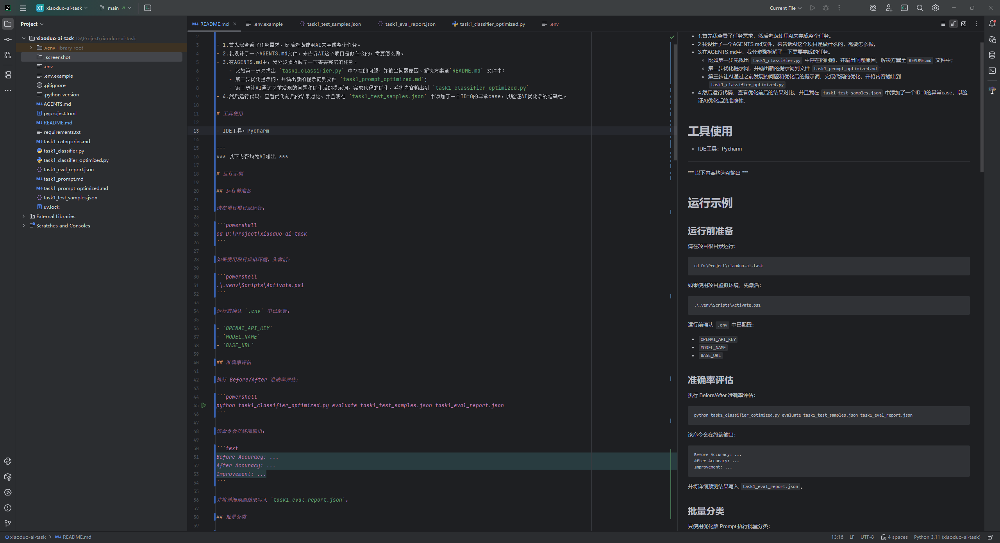
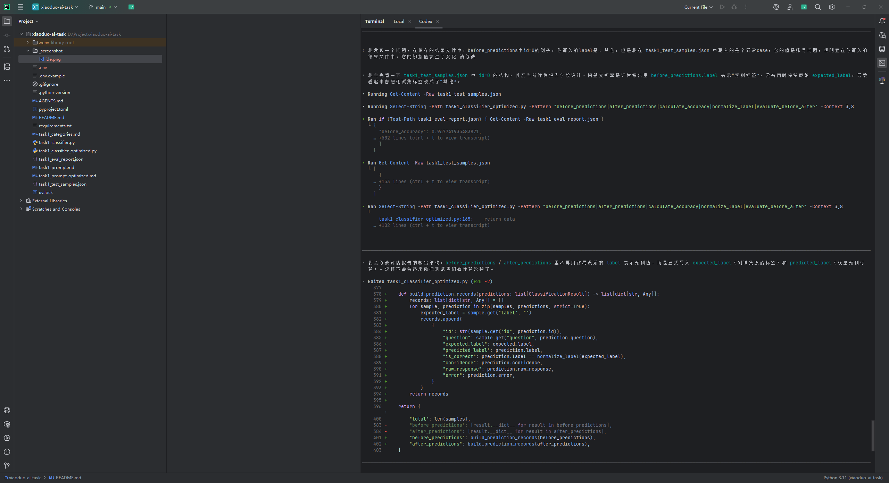

# 整体Task实现思路(人工实现部分)

- 1.首先我查看了任务需求，然后考虑使用AI来完成整个任务。
- 2.我设计了一个AGENTS.md文件，来告诉AI这个项目是做什么的，需要怎么做。
- 3.在AGENTS.md中，我分步骤拆解了一下需要完成的任务。
    - 比如第一步先找出 `task1_classifier.py` 中存在的问题，并输出问题原因、解决方案至`README.md` 文件中；
    - 第二步优化提示词，并输出新的提示词到文件 `task1_prompt_optimized.md`;
    - 第三步让AI通过之前发现的问题和优化后的提示词，完成代码的优化，并将内容输出到 `task1_classifier_optimized.py`
- 4.然后我review了AI生成的代码，以确保它不会出现问题。
- 5.然后运行代码，查看优化前后的结果对比。并且我在 `task1_test_samples.json` 中添加了一个ID=0的异常case，以验证AI优化后的准确性。

# 工具使用

- IDE工具：Pycharm 
- AI工具：codex 

---
*** 以下内容均为AI输出，包含运行示例，和代码检查、提示词优化中发现的问题以及优化思路 ***

# 运行示例

## 运行前准备

请在项目根目录运行：

```powershell
cd D:\Project\xiaoduo-ai-task
```

如果使用项目虚拟环境，先激活：

```powershell
.\.venv\Scripts\Activate.ps1
```

运行前确认 `.env` 中已配置：

- `OPENAI_API_KEY`
- `MODEL_NAME`
- `BASE_URL`

## 准确率评估

执行 Before/After 准确率评估：

```powershell
python task1_classifier_optimized.py evaluate task1_test_samples.json task1_eval_report.json
```

该命令会在终端输出：

```text
Before Accuracy: ...
After Accuracy: ...
Improvement: ...
```

并将详细预测结果写入 `task1_eval_report.json`。

## 批量分类

只使用优化版 Prompt 执行批量分类：

```powershell
python task1_classifier_optimized.py classify task1_test_samples.json task1_predictions.json
```

该命令会将分类结果写入 `task1_predictions.json`。

---

# Step1 Code Review

## Review 对象

- 文件：`task1_classifier.py`
- 关注范围：LLM 调用逻辑、Prompt 使用方式、返回结果解析、异常处理、代码可维护性

## 发现的问题（按严重程度排序）

### 1. API Key 硬编码在源码中，存在严重安全风险

**位置：** `task1_classifier.py:10-12`

**问题原因：**

当前代码直接在源码中写入 `openai.api_key`，并固定使用 `MODEL = "gpt-4o-mini"`。这会导致密钥随代码提交、复制或分享时泄露，也会使不同环境无法通过配置切换
API Key、模型名称和服务地址。项目说明中已经提到 `.env` 中配置了 `OPENAI_API_KEY`、`MODEL_NAME`、`BASE_URL`，但当前实现没有读取这些配置。

**影响：**

- API Key 泄露后可能产生安全和费用风险。
- 测试、开发、生产环境无法独立配置模型与服务地址。
- 后续切换模型或接入兼容 OpenAI 协议的服务时需要修改源码，维护成本高。

**改进方案：**

- 从环境变量或 `.env` 读取 `OPENAI_API_KEY`、`MODEL_NAME`、`BASE_URL`。
- 不在源码中保存任何真实或示例密钥。
- 初始化 LLM 客户端时集中处理配置校验，缺失配置时给出明确错误。

### 2. Prompt 过于简单，缺少类别定义和冲突判定规则，容易造成分类混淆

**位置：** `task1_classifier.py:17-21`

**问题原因：**

当前 Prompt 只列出类别名称，并要求模型直接返回类别名，但没有提供每个类别的定义、边界、典型例子和多意图问题的优先级规则。例如“退款进度”和“物流进度”都可能包含“进度”“快递”等词，如果没有明确规则，模型容易根据局部关键词误判。

**影响：**

- 相似类别之间容易混淆，例如“退款退货”和“物流查询”、“投诉建议”和具体业务问题。
- 对复合问题缺少主诉求判定逻辑，输出不稳定。
- 准确率依赖模型临场理解，难以稳定提升。

**改进方案：**

- 将 `task1_categories.md` 中的类别定义、典型场景和注意事项整合进优化 Prompt。
- 明确多意图问题按用户主要诉求分类。
- 增加易混淆规则，例如“退款进度查询”归入“退款退货”，包裹位置和派送状态归入“物流查询”。
- 使用 system message 固定角色和输出约束，user message 只放待分类问题。

### 3. 返回结果解析不可靠，没有校验模型输出是否属于合法标签

**位置：** `task1_classifier.py:31-32`

**问题原因：**

代码直接取 `response.choices[0].message.content.strip()` 作为分类结果，没有做任何格式解析、合法标签校验或兜底处理。虽然
Prompt 要求“只回复类别名称”，但 LLM 仍可能输出解释文本、标点、JSON、同义词或多个类别。

**影响：**

- 输出可能无法与测试样本中的 `label` 精确匹配，导致准确率下降。
- 下游系统如果依赖固定标签，可能因为模型多输出一句解释而无法路由。
- 模型返回空内容或异常结构时会产生不可控错误。

**改进方案：**

- 要求模型输出稳定 JSON，例如 `{"id": "...", "confidence": 0.95, "label": "退款退货"}`。
- 使用 `json.loads` 解析模型结果，并校验 `label` 是否属于允许列表。
- 对非法输出做规范化或兜底为“其他”，同时记录原始响应便于排查。

### 4. LLM 调用缺少异常处理、重试和超时控制，批量任务容易中断

**位置：** `task1_classifier.py:23-29`、`task1_classifier.py:40-48`

**问题原因：**

当前每条问题直接调用一次 LLM API，没有捕获网络错误、限流、超时、服务端错误或响应结构异常。批量处理时，只要其中一条失败，整个任务就会中断，并且已经完成的结果也可能无法写入输出文件。

**影响：**

- 偶发 API 报错会导致整批分类失败。
- 无法定位失败样本和失败原因。
- 对测试准确率验证不稳定，可能因为临时网络问题无法完成评估。

**改进方案：**

- 为 LLM 调用增加超时、有限次数重试和指数退避。
- 在单条样本失败时记录错误，并根据业务策略返回“其他”或标记失败，而不是中断整个批次。
- 批量处理时输出进度和失败统计，必要时保留已完成结果。

### 5. 输入数据结构缺少校验，异常数据会触发 KeyError 或类型错误

**位置：** `task1_classifier.py:37-43`

**问题原因：**

代码假设输入 JSON 一定是列表，且每个元素都包含 `id` 和 `question` 字段。但实际数据可能为空、字段缺失、字段类型不正确，或 JSON
文件格式错误。

**影响：**

- 输入稍有异常就会抛出 `KeyError`、`TypeError` 或 `JSONDecodeError`。
- 报错信息不够友好，排查成本高。
- 批量处理鲁棒性不足。

**改进方案：**

- 读取 JSON 后校验顶层结构和每条样本字段。
- 对缺失或非法字段给出明确错误信息。
- 对空问题做兜底分类为“其他”或跳过并记录。

### 6. 代码可维护性较弱，配置、Prompt、标签和调用逻辑耦合在一个函数中

**位置：** `task1_classifier.py:15-32`

**问题原因：**

`classify_question` 同时负责拼接 Prompt、调用模型、解析结果，并且分类标签硬编码在字符串中。Prompt
文件和类别定义文件没有被复用，导致文档与实际代码容易不一致。

**影响：**

- Prompt 优化需要直接修改代码，迭代成本高。
- 分类标签在多个位置重复维护，容易出现拼写或版本不一致。
- 单元测试难以针对 Prompt 构造、LLM 调用和解析逻辑分别验证。

**改进方案：**

- 将标签列表、Prompt 模板、LLM 客户端初始化、结果解析拆分为独立函数。
- 优先从 `task1_prompt_optimized.md` 或常量模板加载 Prompt，避免文档与代码脱节。
- 保留清晰的函数边界，便于后续添加准确率评估和回归测试。

---

# Step2 Prompt Optimization

## 优化产物

- 新增优化后的提示词文件：`task1_prompt_optimized.md`

## 改动理由

1. **拆分 System Prompt 和 User Message**

   原始 Prompt 将角色、分类规则和用户问题全部放在 user message 中，指令层级不清晰。优化后使用 System Prompt
   固定模型角色、合法标签、分类定义和输出规则，User Message 只承载待分类样本，便于代码复用和批量测试。

2. **补充完整类别定义和典型场景**

   原始 Prompt 只列出类别名称，缺少边界说明。优化后为“退款退货、物流查询、账号问题、商品咨询、投诉建议、其他”分别补充定义和典型问题，减少模型只依赖关键词猜测导致的误判。

3. **增加易混淆类别的判定规则**

   测试样本中存在退款与物流、业务咨询与投诉建议混合出现的情况。优化 Prompt
   明确规定退款进度归入“退款退货”，包裹位置和配送异常归入“物流查询”；如果用户主要表达投诉、举报或建议，则归入“投诉建议”，否则按具体业务诉求分类。

4. **明确多意图问题的优先级**

   原始 Prompt 没有说明一条问题同时涉及多个类别时如何处理。优化后要求优先判断用户当前最想解决的主要诉求，避免模型因次要关键词改变分类。

5. **限制输出为可解析 JSON**

   原始 Prompt 仅要求返回类别名，模型仍可能输出解释、标点或同义表述。优化后强制只输出 JSON 对象，并限定字段为 `id`、
   `confidence`、`label`，其中 `label` 必须来自固定标签集合，便于后续用 `json.loads` 解析和校验。

6. **增加兜底规则**

   对问候、闲聊、无意义文本或无法判断意图的问题，优化 Prompt 明确归为“其他”，降低模型过度分类的概率。